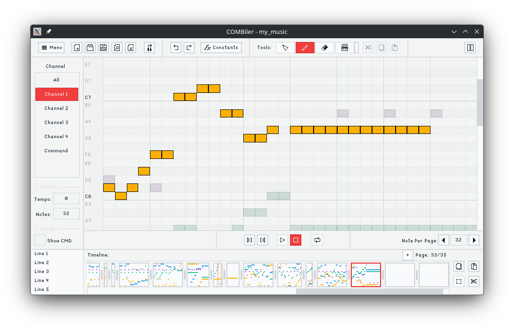
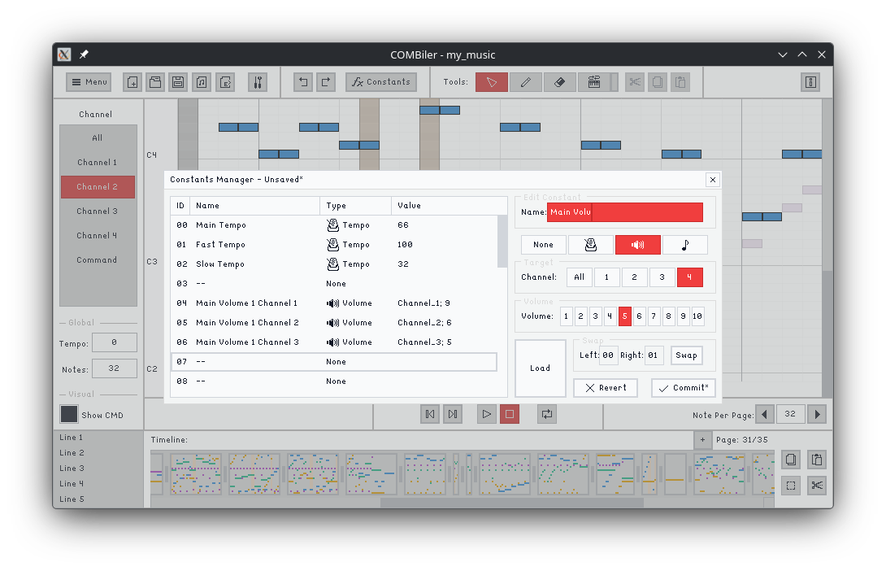

# COMBiler

A music "compiler" for [COMB Optical Music Box](https://github.com/js-lm/COMB-Optical-Music-Box).

[Watch the Demo](https://youtu.be/mm-ovJgS-Bs)

## About The Project

This project is part of the COMB project, where I tried to make a music box that reads color encoded paper strips and plays music. Of course, the machine is nothing without the paper strips, and those strips come with quite a lot of rules, which makes composing by hand manually pretty difficult. So this program provides a graphical user interface to sequence music and "compile" them into paper strips.

The program is ~~copied~~ inspired by [Lovely Composer](https://doc1oo.github.io/LovelyComposerDocs/en/). It's kind of funny, originally, I also wanted to make something like Lovely Composer, but I was too lazy and never actually did it. And yet, here we are. I ended up designing a system so complicated that now I have to build this thing anyway, ugh, work.

## Features

- Quad-Channel: Designed specifically for the encoding system.
- System Command Management: Add and manage commands visually.
- Audio Playback: You can play the music while making it (revolutionary, I know).
- Paper Strip Generator: Generate the paper strip with just one click.
- **Constants Manager**: Save system commands as constants. This lets you tweak one value and have it propagate everywhere. Basically a workaround for the lack of global controls, since the encoding system makes that kind of feature hard to implement.

## Encoding Specification

Please refer to the Base 5 Optical Music Encoding System documentation in the [main hardware repo](https://github.com/js-lm/COMB-Optical-Music-Box/blob/HEAD/documents/base_5_optical_music_encoding_system.md).

## Build

### Prerequisites

- C++20 compiler
- CMake

### Dependencies

This program wouldn't be possible without these libraries (managed by CMake). Big thanks to their authors.

- [raylib](https://github.com/raysan5/raylib) - Rendering
- [raygui](https://github.com/raysan5/raygui) - UI components
- [fmt](https://github.com/fmtlib/fmt) - Formatting
- [magic_enum](https://github.com/Neargye/magic_enum) - Enum reflection
- [TinySoundFont](https://github.com/schellingb/TinySoundFont) - Soundfont synthesizer
- [tinyfiledialogs](https://sourceforge.net/projects/tinyfiledialogs/) - File dialogs

### Build Instructions

Just let CMake do its magic.

## LICENSE
    COMBiler
    A music "compiler" for COMB Optical Music Box.
    Copyright (C) 2026  Joshua Lam <me[at]joshlam.dev>

    This program is free software: you can redistribute it and/or modify
    it under the terms of the GNU General Public License as published by
    the Free Software Foundation, either version 3 of the License, or
    (at your option) any later version.

    This program is distributed in the hope that it will be useful,
    but WITHOUT ANY WARRANTY; without even the implied warranty of
    MERCHANTABILITY or FITNESS FOR A PARTICULAR PURPOSE.  See the
    GNU General Public License for more details.

    You should have received a copy of the GNU General Public License
    along with this program.  If not, see <https://www.gnu.org/licenses/>.